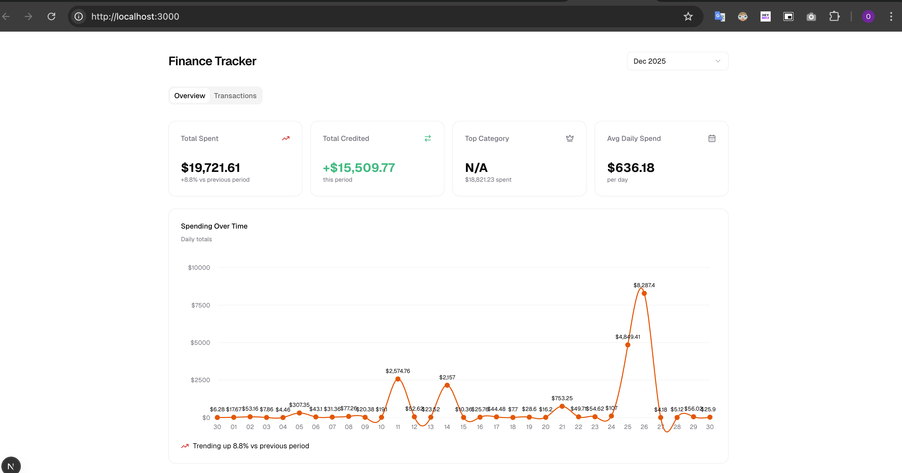
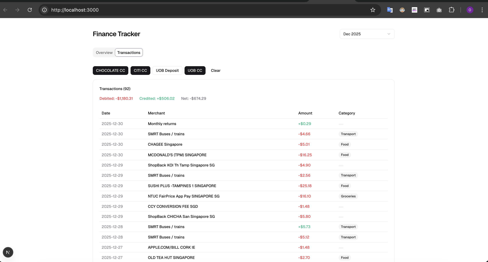

# Lazyledger

> Drop a bank statement. Get a dashboard. That's it.

PDF bank statements → structured data → categorised expenses → spending dashboard.

No APIs. No manual data entry. Just automation for the financially-savvy, yet lazy (me).

**Tech Stack:**


**Supported Banks:**





## Why

I’ve been tracking finances since school. 
No app out there reliably combines expenses across banks, account types, credit and deposit.

So I built my own.

## How it works

```
PDF bank statements
  → preprocessor (Python/Camelot) extracts tables → CSV
    → Go CLI parses CSV, categorises via trie → Postgres
      → Next.js dashboard visualises spending
```

| Stage | What happens |
|-------|-------------|
| **Extract** | Python reads PDFs, pulls out transaction tables |
| **Ingest** | Go parses CSVs, categorises via prefix trie, bulk-inserts into Postgres |
| **Visualise** | Next.js dashboard — trends, categories, daily averages |

## Caveats
- **Bank-specific parsing** — each bank needs its own extraction logic. ~10 lines per bank, <20 banks in SG. Not too terrible.
- **Manual categories** — the app doesn’t auto-categorise yet. You define categories under `./categories/` (filename = category, contents = merchant prefixes). Trie matching handles the rest. E.g., `AIRBNB` in `travel` matches `AIRBNB * HMS922XSAR 653-163-1004 Ref No. : 51972375084209692168650`.

## Upcoming Improvements
- AI-powered categorisation

## Quick start

For the curious cat ₍^. .^₎Ⳋ

```bash
# 1. Drop PDFs into preprocessor/statements/
#    Named: <bank>_<mmm>_<yyyy>.pdf (e.g. uob_jan_2026.pdf)
#    Deposit accounts: uob_jan_2026_deposit.pdf

# 2. Install & run
cd preprocessor && pip install -r requirements.txt && cd ..
make preprocess            # PDF → CSV
docker compose up -d       # start Postgres
go run . local             # ingest into DB
make frontend              # dashboard at localhost:3000

# Or just:
make all
```

Open to collaboration.